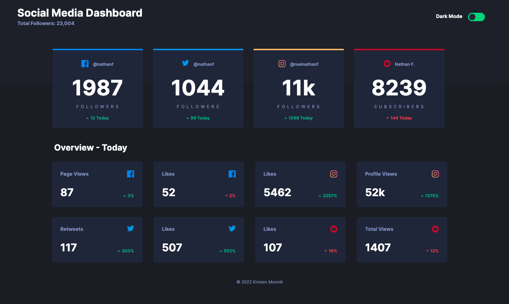
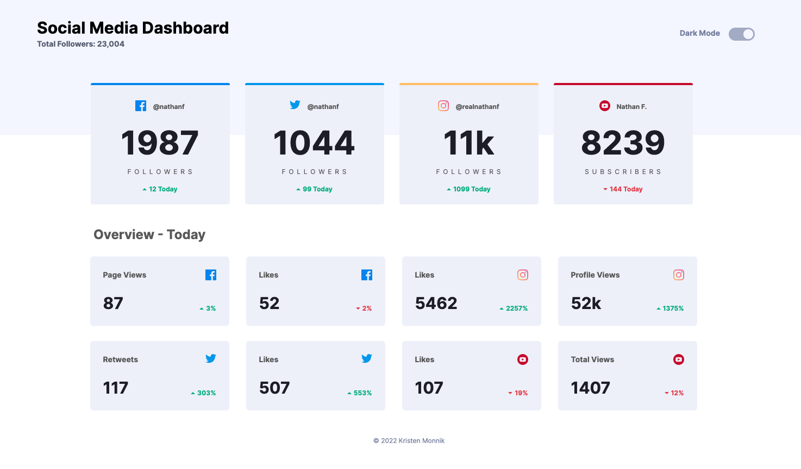

# Social Media Dashboard

This is a social media dashboard landing page with a dark/light theme switcher.

Users should be able to:
- view the optimal layout for the site depending on their device's screen size
- see hover states for all interactive elements on the page (cards and toggle switch)
- toggle color theme to their preference

This is a solution to the [Social Media Dashboard challenge on Frontend Mentor](https://www.frontendmentor.io/challenges/social-media-dashboard-with-theme-switcher-6oY8ozp_H).

## Table of contents

- [Overview](#overview)
  - [The challenge](#the-challenge)
  - [Screenshots](#screenshots)
  - [Links](#links)
- [My process](#my-process)
  - [Built with](#built-with)
  - [What I learned](#what-i-learned)
  - [Future iterations](#future-iterations)
- [Author](#author)

## Overview

### The challenge

- Build out the project to the provided wireframe designs

### Screenshots

### Links

- Solution URL: [GitHub repo](https://github.com/k-monnik/maker-landing-page)
- Live Site URL: [Social Media Dashboard - Netlify](https://km-social-media-dashboard.netlify.app)

## My process

### Built with

- React
- JSX
- Flexbox
- CSS Grid
- Mobile-first workflow
- [Tailwind CSS](https://tailwindcss.com) - CSS framework

### What I learned

With this project, I had fun learning how to implement the dark/light theme switcher using JavaScript and styling the toggle switch using Tailwind. The Tailwind `dark` variant made it simple to style the various theme color changes throughout the project.

### Future iterations

I will be adding gradient color styling to a few elements soon.

## Author

- Website - [Kristen Monnik](https://www.monnik.dev)
- Frontend Mentor - [@k-monnik](https://www.frontendmentor.io/profile/k-monnik)
- Twitter - [@kmonnik_dev](https://twitter.com/kmonnik_dev)
- GitHub - [@k-monnik](https://github.com/k-monnik)